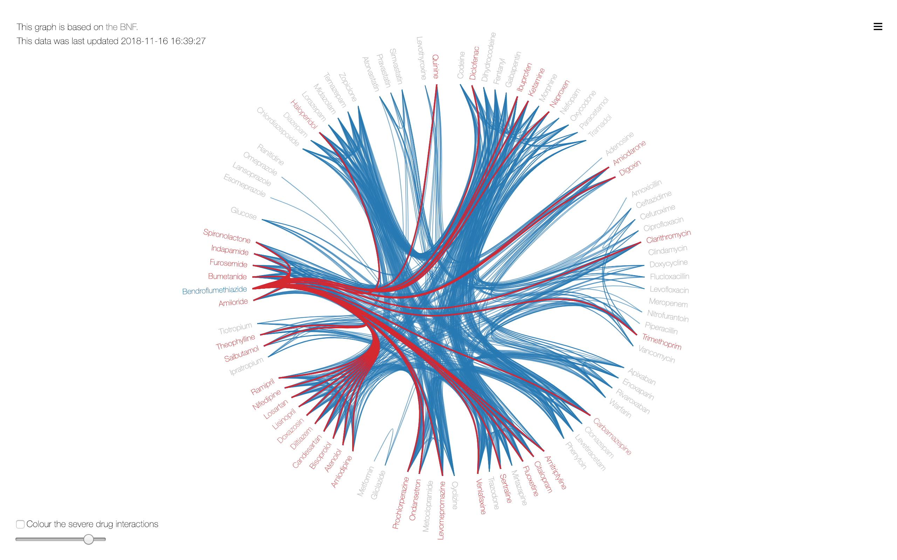

# BNF Interactions
A dedicated repository for work I started in [D3.](https://github.com/fergustaylor/D3) A project visualising [BNF Interaction](https://bnf.nice.org.uk/interaction/) data.

It contains all the code to collect your own BNF Interactions data, reconstruct the same graphics, or for you to create your own.

This data is currently collected periodically, with the last update listed on the left-hand corner of any graphics.

© NICE 2018. BNF Interactions. Available from https://bnf.nice.org.uk/interaction/ All rights reserved. Subject to Notice of rights. NICE guidance is prepared for the National Health Service in England. All NICE guidance is subject to regular review and may be updated or withdrawn. NICE accepts no responsibility for the use of its content in this product/publication.

The main graphic I've used in ['Build my Graph'](https://fergustaylor.github.io/bnf-interactions/) and ['top 100'](https://fergustaylor.github.io/bnf-interactions/top100/) is based on the work of [Mike Bostock](https://beta.observablehq.com/@mbostock), creator of D3.js and the original graph is shown [here](https://mbostock.github.io/d3/talk/20111116/bundle.html). 
You can find a fantastic version of this as an observable notebook [here](https://beta.observablehq.com/@mbostock/d3-hierarchical-edge-bundling).
This in turn, is a D3.js implementation of [Danny Holten's](http://www.win.tue.nl/~dholten/) hierarchical edge bundling algorithm.

